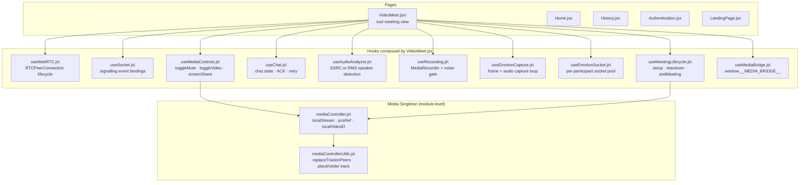
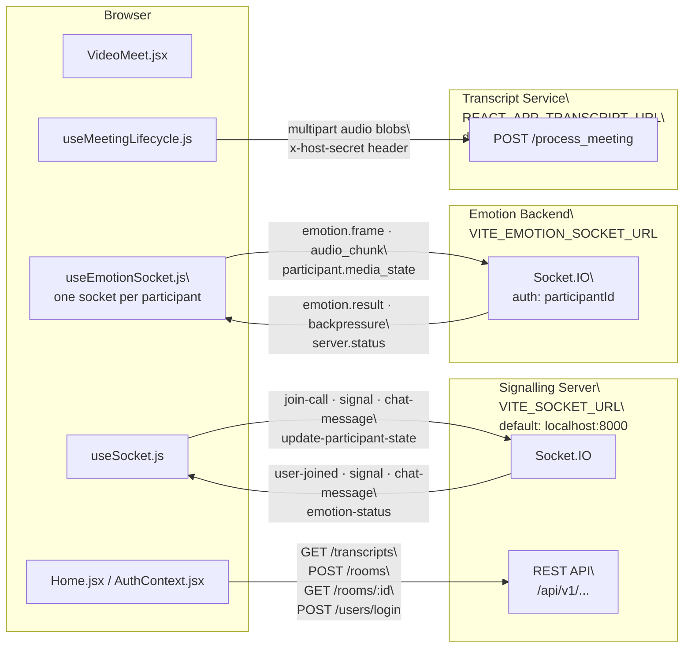
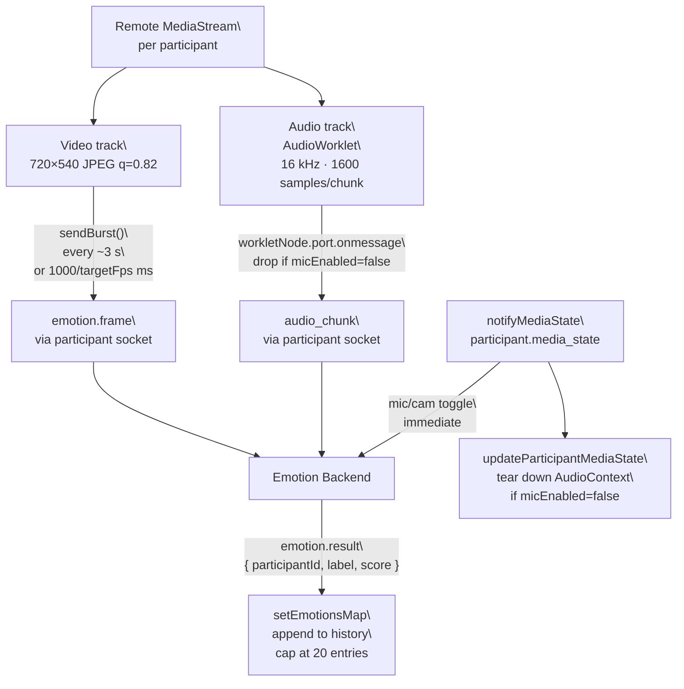
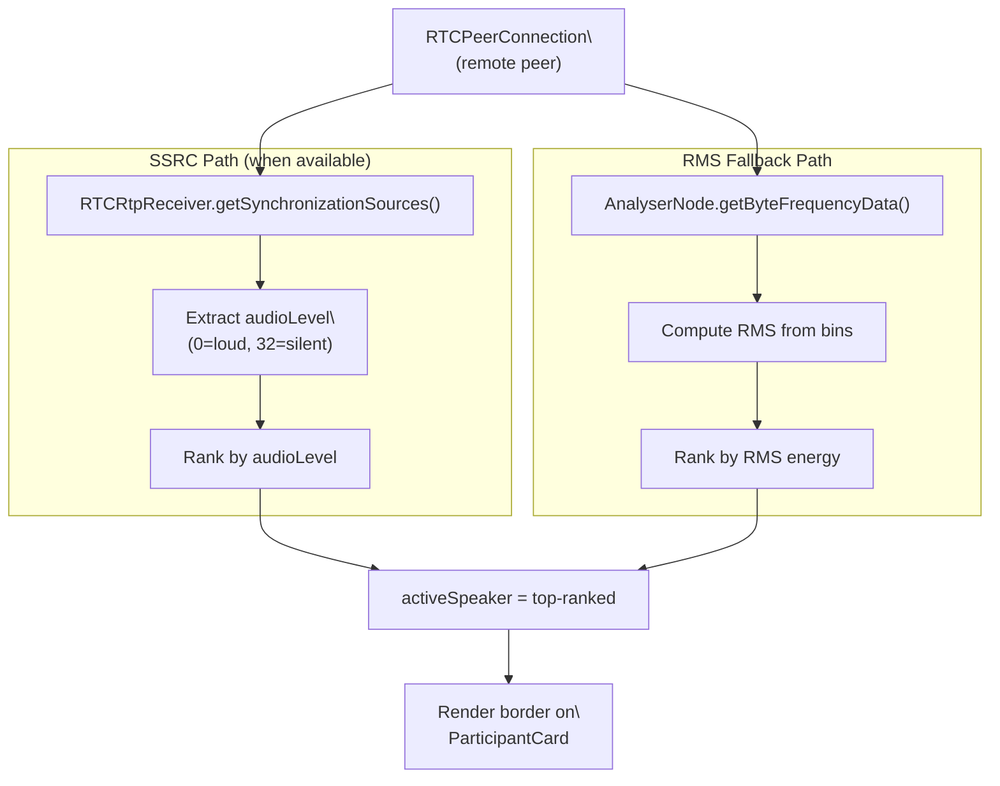

# Hoovik — Frontend

## Overview

Hoovik is a React-based browser application for multi-party video meetings. It combines WebRTC peer connections (negotiated via a Socket.IO signalling server), a real-time emotion analysis pipeline, an in-meeting chat system, and a post-meeting transcript viewer. The frontend is structured as a single-page application with React Router. Authentication is JWT-based; the token is persisted in `localStorage`.

---

## Features

The following features are implemented and directly observable in the source:

- **Multi-party video via WebRTC** — each remote peer gets its own `RTCPeerConnection`, managed in `useWebRTC.js`. Perfect-negotiation (polite/impolite roles) is implemented.
- **Active-speaker detection** — two independent detection paths exist: an SSRC-based path using `RTCRtpReceiver.getSynchronizationSources()` (used when available) and an RMS-based fallback using Web Audio API `AnalyserNode`. Both are in `useAudioAnalyzer.js`.
- **Real-time emotion analysis** — the host sends video frames (`emotion.frame`) and audio chunks (`audio_chunk`) for each remote participant over per-participant Socket.IO connections to a separate emotion backend (`VITE_EMOTION_SOCKET_URL`). Implemented in `useEmotionCapture.js` and `useEmotionSocket.js`.
- **Noise-gated audio recording** — the host records each participant's audio stream using `MediaRecorder`. Chunks are gated by an RMS noise gate before being counted as speech. Implemented in `useRecording.js`.
- **In-meeting chat** — real-time, socket-delivered chat with pending/sent/failed delivery states, ACK timeout (`ACK_TIMEOUT_MS = 5000` ms, `useChat.js`), and retry support.
- **Screen sharing** — replaces the local video track in all peer connections via `replaceTrackInPeers` (`mediaControllerUtils.js`).
- **Post-meeting transcript submission** — after the host ends a meeting, recorded audio blobs are posted to `TRANSCRIPT_ENDPOINT` as multipart form data. The transcript is fetched on the Home page and displayed via `TranscriptViewer.jsx`.
- **Responsive mobile layout** — below 900 px (configurable in `VideoMeet.jsx` via `useIsMobile(900)`), the UI switches to a bottom-sheet panel for chat and emotion views, and the filmstrip becomes horizontal.
- **Meeting history** — participants and host are recorded via `addToUserHistory` in `AuthContext.jsx`. Server endpoints are tried in sequence with a `localStorage` fallback.

---

## Architecture

### Component & Hook Composition

### External Server Connections

### Emotion Capture Pipeline

### Active-Speaker Detection

---

## Environment Variables

| Variable | Required? | Used In |
|---|---|---|
| `VITE_SIGNALING_URL` | *(optional)* | `meetConfig.js` (default: `http://localhost:8000`) |
| `VITE_API_URL` | *(optional)* | `meetConfig.js` (default: `http://localhost:8000/api/v1`) |
| `VITE_EMOTION_SOCKET_URL` | *(optional)* | `useEmotionSocket.js` (default: `http://localhost:8000`) |
| `VITE_TRANSCRIPT_URL` | *(optional)* | `meetConfig.js`; falls back to `VITE_AI_URL` then `http://localhost:5001/process_meeting` |
| `VITE_AI_URL` | *(optional)* | `meetConfig.js` (legacy fallback for `VITE_TRANSCRIPT_URL`) |
| `VITE_TURN_URL_UDP` | *(optional)* | `meetConfig.js` |
| `VITE_TURN_URL_80` | *(optional)* | `meetConfig.js` |
| `VITE_TURN_URL_443` | *(optional)* | `meetConfig.js` |
| `VITE_TURN_URL_443_TCP` | *(optional)* | `meetConfig.js` |
| `VITE_TURN_URL_TLS` | *(optional)* | `meetConfig.js` |
| `VITE_TURN_USERNAME` | *(optional)* | `meetConfig.js` |
| `VITE_TURN_CREDENTIAL` | *(optional)* | `meetConfig.js` |

Note: `ICE_CONFIG` in `meetConfig.js` uses only `VITE_TURN_*` prefixed variables (not `REACT_APP_TURN_*`). TURN entries with an undefined URL are filtered out at build time.

---

## Socket.IO Events

### Room signalling events (emitted by client)

| Event | Payload | Handled In |
|---|---|---|
| `join-call` | `{ roomCode, hostSecret?, nickName, peerId }` | Server: `handleJoinCall`; client awaits `{ ok, participants, participantsMeta }` |
| `declare-host` | `{ roomCode, hostSecret }` | Server returns `{ ok }` in ACK |
| `signal` | `{ to, data: RTCSessionDescription \| RTCIceCandidate }` | `useSocket.js` → `handleSignal` |
| `chat-message` | `{ text, createdAt }` | `useSocket.js`; server sends ACK and broadcasts to room |
| `leave-call` | `{ roomCode }` | Server calls `handleLeave` |
| `end-meeting` | `{ roomCode }` | Server closes the room (host only) |
| `emotion-status` | `{ isActive }` | Server updates `roomEmotionState` in Redis |
| `update-participant-state` | `{ participantId, muted }` | Server broadcasts to room participants |

### Room signalling events (received by client)

| Event | Payload | Handled In |
|---|---|---|
| `user-joined` | `{ peerId, nickName, participantsMeta }` | `useSocket.js` → creates new RTCPeerConnection |
| `signal` | `{ from, data }` | `useSocket.js` → calls `handleSignal` |
| `chat-history` | `useSocket.js` → seeds chat state |
| `chat-message` | `useSocket.js` → calls `handleIncomingMessage` |
| `chat-ack` | `useSocket.js` → calls `handleAck` |
| `update-participant-state` | `useSocket.js` → updates `participantsMeta.meta.muted` |
| `emotion-status` | `useSocket.js` + `VideoMeet.jsx` → updates `emotionLive` state (non-host only) |
| `transcript-request-received` | `useSocket.js` → calls `onTranscriptRequestReceived`; `home.jsx` → adds request to `pendingRequests` and `bannerRequests` |
| `transcript-request-update` | `useSocket.js` → calls `onTranscriptRequestUpdate`; `home.jsx` → updates `myRequests` status; shows snack and refreshes transcripts on `approved` |
| `disconnect` | `useSocket.js` → deferred cleanup after 15 seconds if no PCs remain |

### Emotion backend events (emitted by client)

| Event | Payload | Description |
|---|---|---|
| `emotion.frame` | `{ meetingId, participantId, buffer: Uint8Array }` | JPEG frame |
| `audio_chunk` | `Uint8Array` | 1600-sample Float32 PCM at 16 kHz |
| `participant.media_state` | `{ participantId, micEnabled, cameraEnabled }` | Immediate modality update |

### Emotion backend events (received by client)

| Event | Handled In |
|---|---|
| `emotion.result` | `useEmotionSocket.js` → `handleEmotion` |
| `server.status` | `useEmotionSocket.js` → updates `serverCapsRef.targetFps` |
| `backpressure` | `useEmotionSocket.js` → updates `serverCapsRef.suggestedFps` |
| `emotion.error` | `useEmotionSocket.js` → `console.warn` |

### REST API (client-side calls)

| Method + Path | Used In | Purpose |
|---|---|---|
| `POST /api/v1/rooms` | `home.jsx` | Create room, receive `roomCode` + `hostSecret` |
| `GET /api/v1/rooms/mine` | `home.jsx` | Fetch rooms owned by authenticated user |
| `GET /api/v1/rooms/:id` | `home.jsx` | Validate room before joining |
| `GET /api/v1/transcripts?limit=200` | `home.jsx` | Fetch transcript list |
| `POST TRANSCRIPT_ENDPOINT` | `useMeetingLifecycle.js` | Submit audio for transcription |
| `POST /api/v1/users/register` | `AuthContext.jsx` | Register |
| `POST /api/v1/users/login` | `AuthContext.jsx` | Login, receive JWT |
| `GET /api/v1/users/me` | `AuthContext.jsx` | Hydrate user on load |
| `POST /api/v1/auth/logout` | `AuthContext.jsx` | Server-side logout |
| `GET /api/v1/users/get_all_activity` | `home.jsx`, `AuthContext.jsx` | Meeting history |
| `POST /api/v1/meetings` | `AuthContext.jsx` | Record meeting (with fallback) |
| `POST /api/v1/transcript-requests` | `home.jsx` | Submit transcript access request for a meeting |
| `GET /api/v1/transcript-requests/host?status=pending` | `home.jsx` | Load pending requests where caller is host |
| `GET /api/v1/transcript-requests/mine` | `home.jsx` | Load requests submitted by authenticated user |
| `PATCH /api/v1/transcript-requests/:id/resolve` | `home.jsx` | Host approves or denies a transcript request |
| `POST /api/v1/transcripts/:id/summary` | `TranscriptViewer.jsx` | Body: `{ emotionData, emotionNames }` read from `localStorage` keys `emotions:<code>` and `emotionNames:<code>`. Triggers Groq AI summary generation with live emotion annotation; response includes `discrepancies` array rendered inline in the OVERVIEW block. |

---

## Emotion Display Logic (`emotionHelpers.js`)

- `formatTopEmotion(emotion)` normalises a variety of input shapes (string, array, object with `probs`, object with `label`/`score`) to `{ label, score }`.
- `getTopEmotionLabel` applies a post-processing rule: `sad` with `score < 0.65` is remapped to `neutral/calm`.
- `EMOTION_DISPLAY_MIN_SCORE = 0.42` — emotions with a normalised score below this are not rendered.
- Valid emotion labels: `angry`, `fearful`, `disgust`, `happy`, `sad`, `neutral/calm`, `neutral`.
- `EmotionGroupSummary` aggregates emotion counts over the last 30 seconds. It renders up to 4 dominant emotions as percentage bars.
- `EmotionAIInsight` generates a single text insight string from the last 30 seconds of data. The logic is rule-based (threshold comparisons), not model-based. It runs inside `useMemo`.

---

## Error Handling

- **`getUserMedia` failures** in `useMeetingLifecycle.js` are caught; the user is alerted and the room key is removed from `_activeRooms`.
- **Socket connection timeout** (8 s) rejects the setup promise, caught by the same `try/catch`.
- **`MediaRecorder` init failure** in `useRecording.js` — caught per-participant; the affected recorder is skipped.
- **`AudioWorklet.addModule` failure** in `useEmotionCapture.js` — caught; `audioStateRef` entry is deleted, audio capture is skipped for that participant.
- **`RTCPeerConnection` ICE failure** — `restartIce()` is attempted. If connection state becomes `"failed"`, `teardown(peerId)` is called.
- **Chat ACK timeout** — after `ACK_TIMEOUT_MS = 5000` ms, message status is set to `"failed"`. Retry is user-initiated.
- **Transcript submission failures** — retried up to 3 times with exponential backoff. Client-side errors (4xx) abort immediately. After all retries are exhausted, the user is shown a browser `alert`.
- **`History.jsx` fetch failure** — error is stored in state and displayed in the UI. The `AuthContext.getHistoryOfUser` attempts multiple server endpoints before falling back to `localStorage`.
- **`AuthContext.jsx` `addToUserHistory`** — tries up to four endpoints in sequence; falls back to `localStorage`. All failures are logged via `console.warn`.
- Socket disconnect in `useSocket.js` — a 15-second timer is set. If the socket has not reconnected and no peer connections remain, `cleanupAll` is called and the user is navigated to `/home`.

---

## Security Considerations

The following are observable from the implementation:

- JWT is stored in `localStorage` and attached as a `Bearer` token in all API requests.
- `hostSecret` is stored in `localStorage` under the key `host:<ROOM_CODE>` and sent as `x-host-secret` header with transcript upload requests.
- The host role is server-verified: `localStorage` is used only to decide whether to attempt `declare-host`. `isHost` state is set to `true` only after the server returns `{ ok: true }` in the ACK, gating all host UI and behaviour on `Meeting.verifyHostSecret` passing.
- `home.jsx` calls `cleanInvalidHosts()` on mount to remove `localStorage` entries that lack a `hostSecret`.
- Socket authentication for the emotion backend uses `auth: { participantId }` in the Socket.IO connect options. The value is the participant's user ID or socket ID as resolved in `useEmotionCapture.js → resolveParticipantId`.
- TURN credentials are read entirely from environment variables (`VITE_TURN_USERNAME`, `VITE_TURN_CREDENTIAL`, `VITE_TURN_URL_*`). No credentials are hardcoded in `meetConfig.js`.

---

## Known Limitations

All items below are grounded in code structure or explicit comments:

1. **`_activeRooms` is a module-level `Set`** — in `useMeetingLifecycle.js`. It persists across React hot-reloads in development, which can cause the guard to suppress room re-entry.
2. **Safari video preview refresh workaround** — explicitly implemented in `refreshSafariPreview` to ensure reliable video rendering on Safari.
3. **`AudioWorklet` blob URL is created per participant** — `useEmotionCapture.js` creates and revokes a `Blob` URL for the worklet processor code each time `ensureParticipantAudio` is called. If many participants join rapidly, multiple `AudioContext` instances may be initialised concurrently.
4. **Camera modality state defaults to `true`** — when syncing remote mute state in `VideoMeet.jsx`, `cameraEnabled` is always passed as `true` because camera state is not tracked in `prevParticipantMuteStateRef`. Only mic state is diffed.
5. **Transcript polling uses exponential backoff, capped at 10 minutes** — `startPollingForTranscript` in `home.jsx` uses backoff delays of `[5, 10, 20, 40]` seconds (with ±20% jitter), then repeats 40-second intervals until the 10-minute wall clock limit is reached. No fixed-interval polling or fixed attempt count is used.
6. **`MAX_TEXT_LENGTH` is enforced client-side only** — `useChat.js` truncates to 2000 characters via `String.slice`. The server is expected to enforce its own limit independently.

---

> **Resolved in recent PRs** — the following items from earlier versions of this list have been fixed:
> - ~~Transcript panel expands indefinitely when "Show more" is clicked~~ — the panel now uses a fixed-height scrollable container ([#9](https://github.com/AnupamKumar-1/Hoovik/issues/9) / [#23](https://github.com/AnupamKumar-1/Hoovik/pull/23))
> - ~~Local video preview overlaps chat input area on desktop when the chat panel is open~~ — preview now repositions dynamically when chat is expanded ([#10](https://github.com/AnupamKumar-1/Hoovik/issues/10))
> - ~~No retry for transcript upload~~ — `uploadTranscriptWithRetry` now retries up to 3 times with exponential backoff and alerts the user on final failure.
> - ~~Host role is client-enforced~~ — `isHost` state now starts as `false` and is set to `true` only after server returns `{ ok: true }` in the `declare-host` ACK; `localStorage` is used only to decide whether to attempt verification.
> - ~~Live emotion data captured during meetings was saved to `localStorage` but never used in AI summary generation~~ — `handleGenerateSummary` in `TranscriptViewer.jsx` now reads `emotions:<code>` and `emotionNames:<code>` from `localStorage` and sends them as `{ emotionData, emotionNames }` in the POST body; `SummaryPanel` renders the returned `discrepancies` inline in the OVERVIEW text block using `emotionMeta` colours and icons.
> - ~~Host "End Meeting" kicks all participants~~ — `end-meeting` is now a silent host leave; the server calls `handleLeave` for the host only and does not broadcast to participants.

---

## Future Improvements

Naturally following from the limitations above:

- Dynamic TURN credential provisioning (time-limited credentials from a server endpoint), even though credentials are currently sourced from env vars rather than being hardcoded.
- Camera mute state tracking in the remote mute diff to avoid always passing `cameraEnabled: true`.
- Reduce `AudioWorklet` module instantiation cost by sharing a single blob URL across participants within a session.